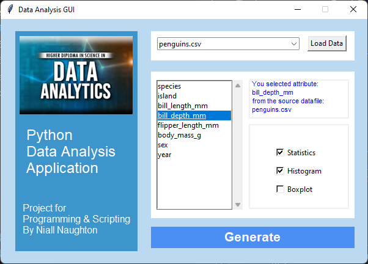

# Programming and Scripting Project 2025
This a file repository for the final project in module 4122 : programming and scripting for year 2025

> Author: Niall Naughton  
> Email : G00473476@atu.ie  
> Course : 4122 : programming and scripting  
> Lecturer : Andrew Beatty (andrew.beatty@atu.ie)  
> Date : March 2025  
***
# Project Description:  
## Exploring the Iris dataset  
   

  
https://en.wikipedia.org/wiki/Iris_flower_data_set  
https://archive.ics.uci.edu/dataset/53/iris


The Iris dataset is earliest and the most famous dataset used in machine learning today for the purpose of classification.
The dataset was originally created by British mathematician Ronald Fisher in his 1936 paper : 
> The use of multiple measurements in taxonomic problems  
https://onlinelibrary.wiley.com/doi/10.1111/j.1469-1809.1936.tb02137.x

  

  The CSV file containing the datset can be downloaded from the UC Irvine Machine Learning Repository:
  https://archive.ics.uci.edu/dataset/53/iris  
  
  Alternatively, you can load this dataset directly within Python by importing the scikit-learn module  
https://scikit-learn.org/1.4/auto_examples/datasets/plot_iris_dataset.html  

```
from sklearn import datasets  
iris = datasets.load_iris()
```

***
### <font color = 'crimson'>The several stages of analysis for this dataset are organized into a series of jupyter notebooks: </font>  
Each stage ends with some form of python script that addresses the topics of analysis stage.

[**Stage 1** : First look at new dataset ](notebooks/exploring_the_iris_dataset_1.ipynb)   
Opening up dataset for first time. Reviewing the raw data, the different approaches for extracting this data, and managing the different Data types within returned objects  
[(Extra) : Code Exploring the various approaches to reading data in iris dataset ](code/iterable_collections.py)  

[**Stage 2** : Cleaning the dataset ](notebooks/cleansing_dataset.ipynb)   
Exploring the quality of the data, and the necessity for data cleansing.

[**Stage 3** : Statistical Summary of data values ](notebooks/iris_statistical_summary.ipynb)   
Exploring a statistical summary of each of iris dataset's fields/features independently  
Sending results to a markdown formatted **jupyter notebook** for a structured/presentable format  
[Custom Module for Statistical Analysis](code/stats_util.py)   
[Code generating statistical results for iris dataset and outputting to notepad ](code/iris_stats_summary.py)   
[Notebook for Statistical Analysis on Iris Dataset](notebooks/iris_summary.ipynb)   
[Notebook for Statistical Analysis on Daily Gold Rate (across currencies) Dataset](notebooks/gold_rates_summary.ipynb)   

[**Stage 4** : Distribution Visualization of data values ](notebooks/visualizing_distributions.ipynb)   
Exploring the characteristics of Iris features further with the use of visual plots   
[Notebook for Exploring the Matplotlib ploting features](notebooks/exploring_matplotlib_layouts.ipynb)   
[Notebook for Exploring visual plots of Iris features](notebooks/visualizing_distributions.ipynb)   
Visual plots generated include:  
 * Histograms  
 * Boxplots
 * Text Boxes (additional annotation)


[**Stage 5** : Visualization of Feature Relationships ](notebooks/exploring_feature_relationships.ipynb)   
The Iris features (Sepal length/width (cm) and petal length/width) are not entirely independent of each other, and we now need to explore any possible relationship between these features.   
Relationships between features could be ...   
* Linear
* Non-linear
* non-deterministic

We will use scatter plots to try and visually identify any potential relationships (linear/non-linear/etc.) between all the combinations of features available in the Iris dataset.  
[Notebook for Exploring the Matplotlib Scatter plot features](notebooks/exploring_matplotlib_scatterplots.ipynb)   
The Python Script for this stage looks at displaying scatterplots/Histograms for all combinations of Iris Feature Pairs.  
It is a very cluttered and Visually dense, but this is an coding exercise in managing large a matrix of data.  This plots 16 different plots, each color-coded by 3 class, and each plot is in itself a 4x4 grid. Its a messy, but from a coding perspective it did the job!   
[Code for displaying scatterplots/Histograms for all combinations of Iris Feature Pairs](code/Relationship_analysis.py)  
In the next stage (which has very similar plots) ... I will address plotting a much neater set of visualizations.

[**Stage 6** : Quantify Patterns of Feature Relationships ](notebooks/quantify_relationship_analysis.ipynb)   
Taking the last set of plots, from stage #5 where I generated a grid of scatter/histo plots for each combination of features within the Iris dataset, I will apply a linear regression line to each plot to further review the linear correlation between feature pairs  
[Updated scatterplots/Histograms for all combinations of Iris Feature Pairs](code/Relationship_analysis_2.py)  
In the next stage (which has very similar plots) ... I will address plotting a much neater set of visualizations.

[**Final Application** : Python GUI Application for Analyzing different datasets ](code/final_stage_app/Documentation/final_stage_app.ipynb)   

As a final submission for this course Project, I decided to take on the challenge of generating ...
* A Python GUI Application
* That can load different datasets (from CSV files) 
* Give the App User the option to select the attribute (of the chosen dataset) 
* Allow the user to select the type of plot visualization required (Stats, Histograms, Boxplots)
* Output results (if multiple plots required) into a singe Jupyter Notebook
* Implement Application configuration and Logging for GUI Form
   



